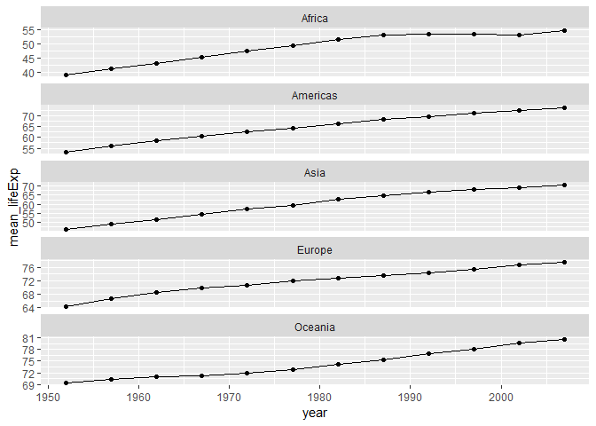

### Load Packages

```r
suppressPackageStartupMessages(library(tidyverse))
suppressPackageStartupMessages(library(gapminder))
library(knitr)
library(kableExtra)
suppressPackageStartupMessages(library(tidyverse))
```
### Task 1 :
**Get the maximum and minimum of GDP per capita for all continents**

```r
range_gdp <- gapminder %>%
                group_by(continent) %>% 
                summarize(min_gdp=min(gdpPercap),
                          max_gdp=max(gdpPercap))
knitr::kable(range_gdp)
```

<table>
 <thead>
  <tr>
   <th style="text-align:left;"> continent </th>
   <th style="text-align:right;"> min_gdp </th>
   <th style="text-align:right;"> max_gdp </th>
  </tr>
 </thead>
<tbody>
  <tr>
   <td style="text-align:left;"> Africa </td>
   <td style="text-align:right;"> 241.1659 </td>
   <td style="text-align:right;"> 21951.21 </td>
  </tr>
  <tr>
   <td style="text-align:left;"> Americas </td>
   <td style="text-align:right;"> 1201.6372 </td>
   <td style="text-align:right;"> 42951.65 </td>
  </tr>
  <tr>
   <td style="text-align:left;"> Asia </td>
   <td style="text-align:right;"> 331.0000 </td>
   <td style="text-align:right;"> 113523.13 </td>
  </tr>
  <tr>
   <td style="text-align:left;"> Europe </td>
   <td style="text-align:right;"> 973.5332 </td>
   <td style="text-align:right;"> 49357.19 </td>
  </tr>
  <tr>
   <td style="text-align:left;"> Oceania </td>
   <td style="text-align:right;"> 10039.5956 </td>
   <td style="text-align:right;"> 34435.37 </td>
  </tr>
</tbody>
</table>

```r
range_gdp %>% 
  ggplot(aes(continent,min_gdp)) +
    geom_point(aes(color=continent))
```

<!-- -->

```r
range_gdp %>% 
  ggplot(aes(continent,max_gdp)) +
    geom_point(aes(color=continent))
```

<!-- -->

As it can be seen in the table and graph above, Asia has the widest range of gdpPercap and Oceania has highest minimum gdpPercap. However, Oceania has really low number of observations(due to smaller size).

### Task 2 :
**Look at the spread of GDP per capita within the continents**

```r
gapminder %>%
  group_by(continent) %>%
  summarize(min_gdp=min(gdpPercap),
            max_gdp=max(gdpPercap),
            sd_gdp=sd(gdpPercap),
            mu_gdp = mean(gdpPercap)) %>% 
  kable()
```

<table>
 <thead>
  <tr>
   <th style="text-align:left;"> continent </th>
   <th style="text-align:right;"> min_gdp </th>
   <th style="text-align:right;"> max_gdp </th>
   <th style="text-align:right;"> sd_gdp </th>
   <th style="text-align:right;"> mu_gdp </th>
  </tr>
 </thead>
<tbody>
  <tr>
   <td style="text-align:left;"> Africa </td>
   <td style="text-align:right;"> 241.1659 </td>
   <td style="text-align:right;"> 21951.21 </td>
   <td style="text-align:right;"> 2827.930 </td>
   <td style="text-align:right;"> 2193.755 </td>
  </tr>
  <tr>
   <td style="text-align:left;"> Americas </td>
   <td style="text-align:right;"> 1201.6372 </td>
   <td style="text-align:right;"> 42951.65 </td>
   <td style="text-align:right;"> 6396.764 </td>
   <td style="text-align:right;"> 7136.110 </td>
  </tr>
  <tr>
   <td style="text-align:left;"> Asia </td>
   <td style="text-align:right;"> 331.0000 </td>
   <td style="text-align:right;"> 113523.13 </td>
   <td style="text-align:right;"> 14045.373 </td>
   <td style="text-align:right;"> 7902.150 </td>
  </tr>
  <tr>
   <td style="text-align:left;"> Europe </td>
   <td style="text-align:right;"> 973.5332 </td>
   <td style="text-align:right;"> 49357.19 </td>
   <td style="text-align:right;"> 9355.213 </td>
   <td style="text-align:right;"> 14469.476 </td>
  </tr>
  <tr>
   <td style="text-align:left;"> Oceania </td>
   <td style="text-align:right;"> 10039.5956 </td>
   <td style="text-align:right;"> 34435.37 </td>
   <td style="text-align:right;"> 6358.983 </td>
   <td style="text-align:right;"> 18621.609 </td>
  </tr>
</tbody>
</table>

```r
gapminder %>%
  ggplot(aes(continent,gdpPercap)) +
    scale_y_log10() +
    geom_boxplot(aes(color = continent)) +
    geom_jitter(aes(color = continent),
                alpha = 0.3)
```

<!-- -->

Above graph and table gives the statistical summary of gdpPercap for each continent. Oceania has the highest mean and least standard deviation due to the same reason again and as expected Asia has the highest standard deviation due to the wide spread of data points.

Another view to approach this problem can be to see the count of observations with certain gdpPercap range for each continent, which is given below:


```r
gapminder %>% 
  group_by(continent) %>%
  ggplot(aes(gdpPercap)) +
    geom_histogram(bins = 50) +
    geom_freqpoly(bins = 50) +
    facet_wrap(~continent,
               nrow = 3,
               ncol = 2,
               scale="free_y")
```

<!-- -->

So, we can observe here that Europe has value scattered from 900-50000 gdpPercap and not much skewedness in data. However, it is really centered around 2000 for Africa.

These graphs also confirm the observations made regarding Asia and Oceania above.

### Task 3 :
**How is life expectancy changing over time on different continents?**

```r
gapminder %>%
  group_by(continent, year) %>%
  summarize(mean_lifeExp = mean(lifeExp)) %>%
  kable() %>%
  kable_styling(bootstrap_options = "striped")
```

<table class="table table-striped" style="margin-left: auto; margin-right: auto;">
 <thead>
  <tr>
   <th style="text-align:left;"> continent </th>
   <th style="text-align:right;"> year </th>
   <th style="text-align:right;"> mean_lifeExp </th>
  </tr>
 </thead>
<tbody>
  <tr>
   <td style="text-align:left;"> Africa </td>
   <td style="text-align:right;"> 1952 </td>
   <td style="text-align:right;"> 39.13550 </td>
  </tr>
  <tr>
   <td style="text-align:left;"> Africa </td>
   <td style="text-align:right;"> 1957 </td>
   <td style="text-align:right;"> 41.26635 </td>
  </tr>
  <tr>
   <td style="text-align:left;"> Africa </td>
   <td style="text-align:right;"> 1962 </td>
   <td style="text-align:right;"> 43.31944 </td>
  </tr>
  <tr>
   <td style="text-align:left;"> Africa </td>
   <td style="text-align:right;"> 1967 </td>
   <td style="text-align:right;"> 45.33454 </td>
  </tr>
  <tr>
   <td style="text-align:left;"> Africa </td>
   <td style="text-align:right;"> 1972 </td>
   <td style="text-align:right;"> 47.45094 </td>
  </tr>
  <tr>
   <td style="text-align:left;"> Africa </td>
   <td style="text-align:right;"> 1977 </td>
   <td style="text-align:right;"> 49.58042 </td>
  </tr>
  <tr>
   <td style="text-align:left;"> Africa </td>
   <td style="text-align:right;"> 1982 </td>
   <td style="text-align:right;"> 51.59287 </td>
  </tr>
  <tr>
   <td style="text-align:left;"> Africa </td>
   <td style="text-align:right;"> 1987 </td>
   <td style="text-align:right;"> 53.34479 </td>
  </tr>
  <tr>
   <td style="text-align:left;"> Africa </td>
   <td style="text-align:right;"> 1992 </td>
   <td style="text-align:right;"> 53.62958 </td>
  </tr>
  <tr>
   <td style="text-align:left;"> Africa </td>
   <td style="text-align:right;"> 1997 </td>
   <td style="text-align:right;"> 53.59827 </td>
  </tr>
  <tr>
   <td style="text-align:left;"> Africa </td>
   <td style="text-align:right;"> 2002 </td>
   <td style="text-align:right;"> 53.32523 </td>
  </tr>
  <tr>
   <td style="text-align:left;"> Africa </td>
   <td style="text-align:right;"> 2007 </td>
   <td style="text-align:right;"> 54.80604 </td>
  </tr>
  <tr>
   <td style="text-align:left;"> Americas </td>
   <td style="text-align:right;"> 1952 </td>
   <td style="text-align:right;"> 53.27984 </td>
  </tr>
  <tr>
   <td style="text-align:left;"> Americas </td>
   <td style="text-align:right;"> 1957 </td>
   <td style="text-align:right;"> 55.96028 </td>
  </tr>
  <tr>
   <td style="text-align:left;"> Americas </td>
   <td style="text-align:right;"> 1962 </td>
   <td style="text-align:right;"> 58.39876 </td>
  </tr>
  <tr>
   <td style="text-align:left;"> Americas </td>
   <td style="text-align:right;"> 1967 </td>
   <td style="text-align:right;"> 60.41092 </td>
  </tr>
  <tr>
   <td style="text-align:left;"> Americas </td>
   <td style="text-align:right;"> 1972 </td>
   <td style="text-align:right;"> 62.39492 </td>
  </tr>
  <tr>
   <td style="text-align:left;"> Americas </td>
   <td style="text-align:right;"> 1977 </td>
   <td style="text-align:right;"> 64.39156 </td>
  </tr>
  <tr>
   <td style="text-align:left;"> Americas </td>
   <td style="text-align:right;"> 1982 </td>
   <td style="text-align:right;"> 66.22884 </td>
  </tr>
  <tr>
   <td style="text-align:left;"> Americas </td>
   <td style="text-align:right;"> 1987 </td>
   <td style="text-align:right;"> 68.09072 </td>
  </tr>
  <tr>
   <td style="text-align:left;"> Americas </td>
   <td style="text-align:right;"> 1992 </td>
   <td style="text-align:right;"> 69.56836 </td>
  </tr>
  <tr>
   <td style="text-align:left;"> Americas </td>
   <td style="text-align:right;"> 1997 </td>
   <td style="text-align:right;"> 71.15048 </td>
  </tr>
  <tr>
   <td style="text-align:left;"> Americas </td>
   <td style="text-align:right;"> 2002 </td>
   <td style="text-align:right;"> 72.42204 </td>
  </tr>
  <tr>
   <td style="text-align:left;"> Americas </td>
   <td style="text-align:right;"> 2007 </td>
   <td style="text-align:right;"> 73.60812 </td>
  </tr>
  <tr>
   <td style="text-align:left;"> Asia </td>
   <td style="text-align:right;"> 1952 </td>
   <td style="text-align:right;"> 46.31439 </td>
  </tr>
  <tr>
   <td style="text-align:left;"> Asia </td>
   <td style="text-align:right;"> 1957 </td>
   <td style="text-align:right;"> 49.31854 </td>
  </tr>
  <tr>
   <td style="text-align:left;"> Asia </td>
   <td style="text-align:right;"> 1962 </td>
   <td style="text-align:right;"> 51.56322 </td>
  </tr>
  <tr>
   <td style="text-align:left;"> Asia </td>
   <td style="text-align:right;"> 1967 </td>
   <td style="text-align:right;"> 54.66364 </td>
  </tr>
  <tr>
   <td style="text-align:left;"> Asia </td>
   <td style="text-align:right;"> 1972 </td>
   <td style="text-align:right;"> 57.31927 </td>
  </tr>
  <tr>
   <td style="text-align:left;"> Asia </td>
   <td style="text-align:right;"> 1977 </td>
   <td style="text-align:right;"> 59.61056 </td>
  </tr>
  <tr>
   <td style="text-align:left;"> Asia </td>
   <td style="text-align:right;"> 1982 </td>
   <td style="text-align:right;"> 62.61794 </td>
  </tr>
  <tr>
   <td style="text-align:left;"> Asia </td>
   <td style="text-align:right;"> 1987 </td>
   <td style="text-align:right;"> 64.85118 </td>
  </tr>
  <tr>
   <td style="text-align:left;"> Asia </td>
   <td style="text-align:right;"> 1992 </td>
   <td style="text-align:right;"> 66.53721 </td>
  </tr>
  <tr>
   <td style="text-align:left;"> Asia </td>
   <td style="text-align:right;"> 1997 </td>
   <td style="text-align:right;"> 68.02052 </td>
  </tr>
  <tr>
   <td style="text-align:left;"> Asia </td>
   <td style="text-align:right;"> 2002 </td>
   <td style="text-align:right;"> 69.23388 </td>
  </tr>
  <tr>
   <td style="text-align:left;"> Asia </td>
   <td style="text-align:right;"> 2007 </td>
   <td style="text-align:right;"> 70.72848 </td>
  </tr>
  <tr>
   <td style="text-align:left;"> Europe </td>
   <td style="text-align:right;"> 1952 </td>
   <td style="text-align:right;"> 64.40850 </td>
  </tr>
  <tr>
   <td style="text-align:left;"> Europe </td>
   <td style="text-align:right;"> 1957 </td>
   <td style="text-align:right;"> 66.70307 </td>
  </tr>
  <tr>
   <td style="text-align:left;"> Europe </td>
   <td style="text-align:right;"> 1962 </td>
   <td style="text-align:right;"> 68.53923 </td>
  </tr>
  <tr>
   <td style="text-align:left;"> Europe </td>
   <td style="text-align:right;"> 1967 </td>
   <td style="text-align:right;"> 69.73760 </td>
  </tr>
  <tr>
   <td style="text-align:left;"> Europe </td>
   <td style="text-align:right;"> 1972 </td>
   <td style="text-align:right;"> 70.77503 </td>
  </tr>
  <tr>
   <td style="text-align:left;"> Europe </td>
   <td style="text-align:right;"> 1977 </td>
   <td style="text-align:right;"> 71.93777 </td>
  </tr>
  <tr>
   <td style="text-align:left;"> Europe </td>
   <td style="text-align:right;"> 1982 </td>
   <td style="text-align:right;"> 72.80640 </td>
  </tr>
  <tr>
   <td style="text-align:left;"> Europe </td>
   <td style="text-align:right;"> 1987 </td>
   <td style="text-align:right;"> 73.64217 </td>
  </tr>
  <tr>
   <td style="text-align:left;"> Europe </td>
   <td style="text-align:right;"> 1992 </td>
   <td style="text-align:right;"> 74.44010 </td>
  </tr>
  <tr>
   <td style="text-align:left;"> Europe </td>
   <td style="text-align:right;"> 1997 </td>
   <td style="text-align:right;"> 75.50517 </td>
  </tr>
  <tr>
   <td style="text-align:left;"> Europe </td>
   <td style="text-align:right;"> 2002 </td>
   <td style="text-align:right;"> 76.70060 </td>
  </tr>
  <tr>
   <td style="text-align:left;"> Europe </td>
   <td style="text-align:right;"> 2007 </td>
   <td style="text-align:right;"> 77.64860 </td>
  </tr>
  <tr>
   <td style="text-align:left;"> Oceania </td>
   <td style="text-align:right;"> 1952 </td>
   <td style="text-align:right;"> 69.25500 </td>
  </tr>
  <tr>
   <td style="text-align:left;"> Oceania </td>
   <td style="text-align:right;"> 1957 </td>
   <td style="text-align:right;"> 70.29500 </td>
  </tr>
  <tr>
   <td style="text-align:left;"> Oceania </td>
   <td style="text-align:right;"> 1962 </td>
   <td style="text-align:right;"> 71.08500 </td>
  </tr>
  <tr>
   <td style="text-align:left;"> Oceania </td>
   <td style="text-align:right;"> 1967 </td>
   <td style="text-align:right;"> 71.31000 </td>
  </tr>
  <tr>
   <td style="text-align:left;"> Oceania </td>
   <td style="text-align:right;"> 1972 </td>
   <td style="text-align:right;"> 71.91000 </td>
  </tr>
  <tr>
   <td style="text-align:left;"> Oceania </td>
   <td style="text-align:right;"> 1977 </td>
   <td style="text-align:right;"> 72.85500 </td>
  </tr>
  <tr>
   <td style="text-align:left;"> Oceania </td>
   <td style="text-align:right;"> 1982 </td>
   <td style="text-align:right;"> 74.29000 </td>
  </tr>
  <tr>
   <td style="text-align:left;"> Oceania </td>
   <td style="text-align:right;"> 1987 </td>
   <td style="text-align:right;"> 75.32000 </td>
  </tr>
  <tr>
   <td style="text-align:left;"> Oceania </td>
   <td style="text-align:right;"> 1992 </td>
   <td style="text-align:right;"> 76.94500 </td>
  </tr>
  <tr>
   <td style="text-align:left;"> Oceania </td>
   <td style="text-align:right;"> 1997 </td>
   <td style="text-align:right;"> 78.19000 </td>
  </tr>
  <tr>
   <td style="text-align:left;"> Oceania </td>
   <td style="text-align:right;"> 2002 </td>
   <td style="text-align:right;"> 79.74000 </td>
  </tr>
  <tr>
   <td style="text-align:left;"> Oceania </td>
   <td style="text-align:right;"> 2007 </td>
   <td style="text-align:right;"> 80.71950 </td>
  </tr>
</tbody>
</table>

```r
gapminder %>%
  group_by(continent, year) %>%
  summarize(mean_lifeExp = mean(lifeExp)) %>%
  ggplot(aes(year,mean_lifeExp)) +
    geom_point() +
    geom_line() +
    facet_wrap(~continent,nrow=5,scale="free_y")
```

<!-- -->

Trend of mean lifeExp over the years for each continent can be seen above. mean lifeExp change over the years is linear for all the continents with no negative or abnormal trends.

**Maximum change**

Lets find out continent with the maximum change in lifeExp over years. As we can see there is no negative trend we can directly calculate this using last and first year for all the continents


```r
gapminder %>%
  group_by(continent, year) %>%
  summarize(mean_lifeExp = mean(lifeExp)) %>%
  filter(year =="1952" | year == "2007") %>%
  mutate(growth = mean_lifeExp-lag(mean_lifeExp)) %>%
  filter(!is.na(growth)) %>% 
  summarize(max(growth))
```

```
## # A tibble: 5 x 2
##   continent `max(growth)`
##   <fct>             <dbl>
## 1 Africa             15.7
## 2 Americas           20.3
## 3 Asia               24.4
## 4 Europe             13.2
## 5 Oceania            11.5
```

Thus, Asia has the maximum growth in lifeExp.

There are some interesting factors about Asia as seen in the trends above. It created some questions in my mind.

Lets see which country in Asia is responsible the skewedness in gdpPercap data points and how is the trend for pop and lifeExp for those countries or if there is a specific country or not.

As from the graphs in Task 2, we can observe that the data points differing from normal trend are after 40000 gdpPercap.


```r
gapminder %>%
  filter(continent=="Asia" & gdpPercap > 40000) %>%
  kable()
```

<table>
 <thead>
  <tr>
   <th style="text-align:left;"> country </th>
   <th style="text-align:left;"> continent </th>
   <th style="text-align:right;"> year </th>
   <th style="text-align:right;"> lifeExp </th>
   <th style="text-align:right;"> pop </th>
   <th style="text-align:right;"> gdpPercap </th>
  </tr>
 </thead>
<tbody>
  <tr>
   <td style="text-align:left;"> Kuwait </td>
   <td style="text-align:left;"> Asia </td>
   <td style="text-align:right;"> 1952 </td>
   <td style="text-align:right;"> 55.565 </td>
   <td style="text-align:right;"> 160000 </td>
   <td style="text-align:right;"> 108382.35 </td>
  </tr>
  <tr>
   <td style="text-align:left;"> Kuwait </td>
   <td style="text-align:left;"> Asia </td>
   <td style="text-align:right;"> 1957 </td>
   <td style="text-align:right;"> 58.033 </td>
   <td style="text-align:right;"> 212846 </td>
   <td style="text-align:right;"> 113523.13 </td>
  </tr>
  <tr>
   <td style="text-align:left;"> Kuwait </td>
   <td style="text-align:left;"> Asia </td>
   <td style="text-align:right;"> 1962 </td>
   <td style="text-align:right;"> 60.470 </td>
   <td style="text-align:right;"> 358266 </td>
   <td style="text-align:right;"> 95458.11 </td>
  </tr>
  <tr>
   <td style="text-align:left;"> Kuwait </td>
   <td style="text-align:left;"> Asia </td>
   <td style="text-align:right;"> 1967 </td>
   <td style="text-align:right;"> 64.624 </td>
   <td style="text-align:right;"> 575003 </td>
   <td style="text-align:right;"> 80894.88 </td>
  </tr>
  <tr>
   <td style="text-align:left;"> Kuwait </td>
   <td style="text-align:left;"> Asia </td>
   <td style="text-align:right;"> 1972 </td>
   <td style="text-align:right;"> 67.712 </td>
   <td style="text-align:right;"> 841934 </td>
   <td style="text-align:right;"> 109347.87 </td>
  </tr>
  <tr>
   <td style="text-align:left;"> Kuwait </td>
   <td style="text-align:left;"> Asia </td>
   <td style="text-align:right;"> 1977 </td>
   <td style="text-align:right;"> 69.343 </td>
   <td style="text-align:right;"> 1140357 </td>
   <td style="text-align:right;"> 59265.48 </td>
  </tr>
  <tr>
   <td style="text-align:left;"> Kuwait </td>
   <td style="text-align:left;"> Asia </td>
   <td style="text-align:right;"> 1997 </td>
   <td style="text-align:right;"> 76.156 </td>
   <td style="text-align:right;"> 1765345 </td>
   <td style="text-align:right;"> 40300.62 </td>
  </tr>
  <tr>
   <td style="text-align:left;"> Kuwait </td>
   <td style="text-align:left;"> Asia </td>
   <td style="text-align:right;"> 2007 </td>
   <td style="text-align:right;"> 77.588 </td>
   <td style="text-align:right;"> 2505559 </td>
   <td style="text-align:right;"> 47306.99 </td>
  </tr>
  <tr>
   <td style="text-align:left;"> Singapore </td>
   <td style="text-align:left;"> Asia </td>
   <td style="text-align:right;"> 2007 </td>
   <td style="text-align:right;"> 79.972 </td>
   <td style="text-align:right;"> 4553009 </td>
   <td style="text-align:right;"> 47143.18 </td>
  </tr>
</tbody>
</table>

So, from data above Kuwait is the country with most deviating data points and Singapore has one occurence. Lets see trend for Kuwait.


```r
gapminder %>%
  filter(country=="Kuwait") %>%
  ggplot(aes(year,gdpPercap)) +
  geom_point() +
  geom_line()
```

<!-- -->

```r
gapminder %>%
  filter(country=="Kuwait") %>%
  ggplot(aes(year,pop)) +
  geom_point() +
  geom_line()
```

<!-- -->

Initially for first decade, population in Kuwait was really less due to which gdpPercap was high. There is a steep dip in gdpPercap from 1972-1982 in Kuwait. Also, a linear increase in population in same years was observed. Thus, GDP in Kuwait did not increase in proportion to its population due to which that negative trend is observed in that period.
